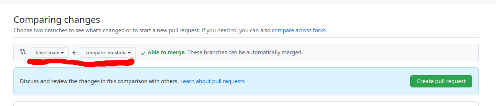

= Шоу, где поют

В "Шоу, где поют" приходят участники и исполняют песни.
Класс `Performance` описывает выступление: оно содержит имя участника и название песни

После выступления судьи подводят итоги: дают свои оценки и комментарии.
Абстрактный класс `Judge` моделирует судью, а класс `Judgement` -- заключение

== Задача

. Понять, что такое полиморфизм footnote:[Вообще, полиморфизм -- это не только переопределение методов. https://en.wikipedia.org/wiki/Polymorphism_(computer_science)[Polymorphism (computer science)]].
Статьи:
.. https://hr-vector.com/java/polimorfizm[Полиморфизм в Java]
.. https://docs.oracle.com/javase/tutorial/java/IandI/polymorphism.html[Polymorphism, The Java™ Tutorials]
. Добавить в программу несколько судей.
Каждый из них по-разному оценивает участников.
Примеры:
.. Судье «А» нравятся песни Radiohead, поэтому он ставит всем, кто их исполняет 5 из 5, а остальным -- 3 из 5.
.. У судьи «Б» всегда хорошее настроение, поэтому она просто так ставит всем 5 из 5.
. Изменить класс `SongPerformanceShow`:
.. Добавить судей в массив `judges`.
.. Добавить несколько выступлений в массив `performances`.

[#submit]
== Как сдавать

=== Если с Git'ом тяжело

. Скачать проект архивом:
.. Code
.. Download ZIP
. Открыть проект в Intellij IDEA:
.. File
.. Open
.. Выберите директорию с проектом
. Выполнить ДЗ
. Экспортировать проект:
.. File
.. Export
.. Project to ZIP file
. Отправить на почту или в Telegram

=== Через Git и GitHub

Варианта 2:

. Создать новый репозиторий на GitHub
. Продолжить в старом

[#newRepository]
==== Новый репозиторий

. Создаём репозиторий:
.. Перейти по ссылке -- https://github.com/new/import
.. Your old repository’s clone URL -- https://github.com/diligent-snail/song-performance
.. Repository name -- можно поменять
.. Privacy -- Private
.. Begin Import
. Получаем проект локально:
.. Открыть git
.. В репозитории на GitHub:
... Нажать «Code»
... Скопировать url.
Пример url'а: `git@github.com:cac03/song-performance.git`
... Выполнить команду:
+
[source,bash]
----
git clone *ваш url*
----
.. Перейти в директорию с проектом:
+
[source,bash]
----
cd *имя проекта*
----
. Создать ветку с решением, пример:
+
[source,bash]
----
git checkout -b solution
----
. Открыть проект в Intellij IDEA:
.. File
.. Open
.. Выберите директорию с проектом
. Написать решение
. В Git консоли:
.. Записываем изменения:
+
[source,bash]
----
git add .
git commit
----
. Отправляем изменения:
+
[source,bash]
----
git push
----
.. О `--set-upstream`: https://stackoverflow.com/questions/37770467/why-do-i-have-to-git-push-set-upstream-origin-branch
. Создать PR:
.. Открываем проект на GitHub
.. Pull Requests
.. New Pull Request
.. Слева -- `main` ветка, справа -- ветка с решением
+

.. Create pull request
. Пригласить в проект меня
. Написать мне в Telegram, на почту или поставить ревьювером в Pull Request

=== Старый репозиторий

. Влить PR со второго ДЗ, если мы его не влили до этого:
.. Открыть PR
.. Нажать «Merge pull request»
. В консоли git:
.. Вернуться в главную ветку:
+
[source,shell]
----
git checkout main
----
.. Получить изменения из GitHub
+
[source,shell]
----
git pull
----
. Скопировать исходники приложения song-performance к себе в проект
. Добавить, сделать коммит, отправить на GitHub:
+
[source,shell]
----
git add .
git commit
git push
----
. Далее -- тоже самое, что в «<<newRepository>>», начиная с пункта «Создать ветку с решением»

